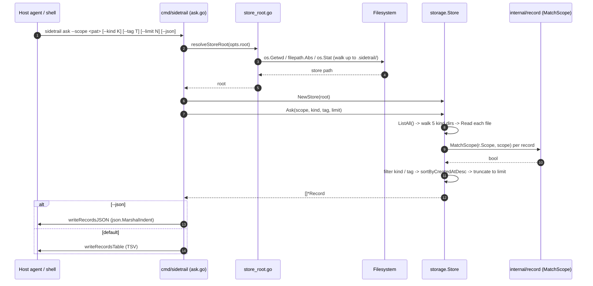
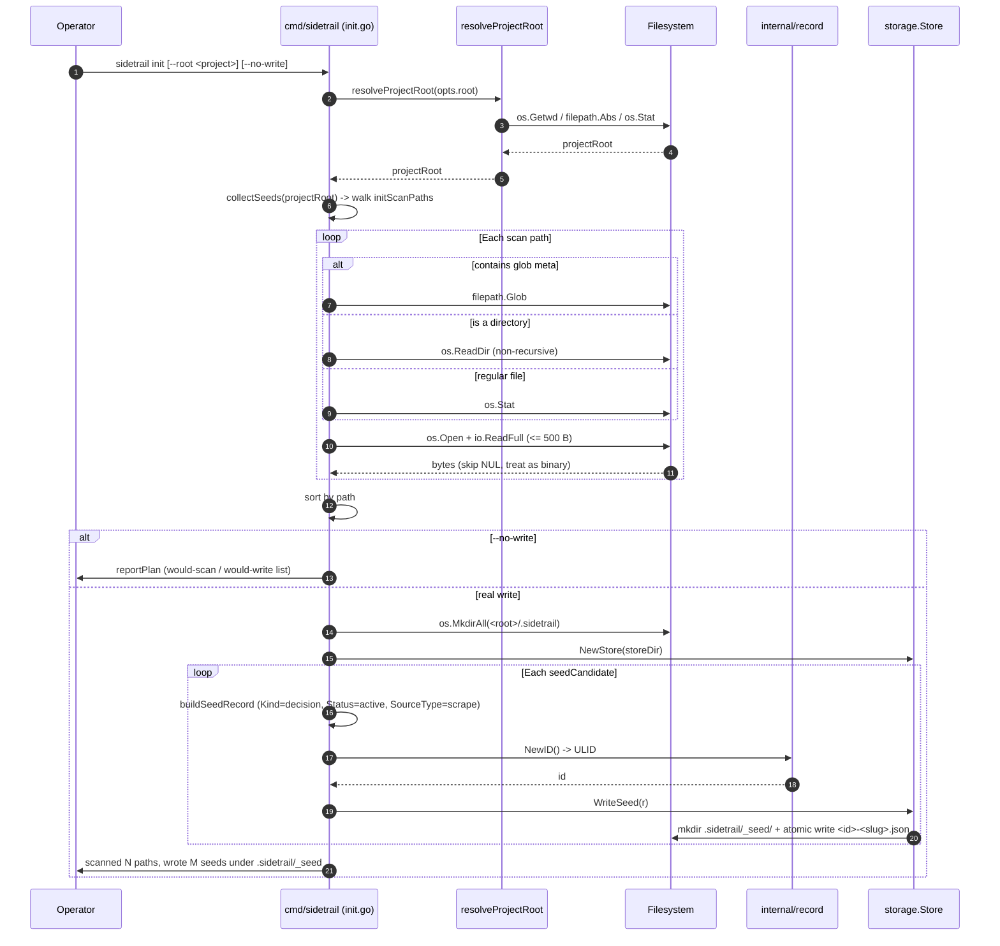
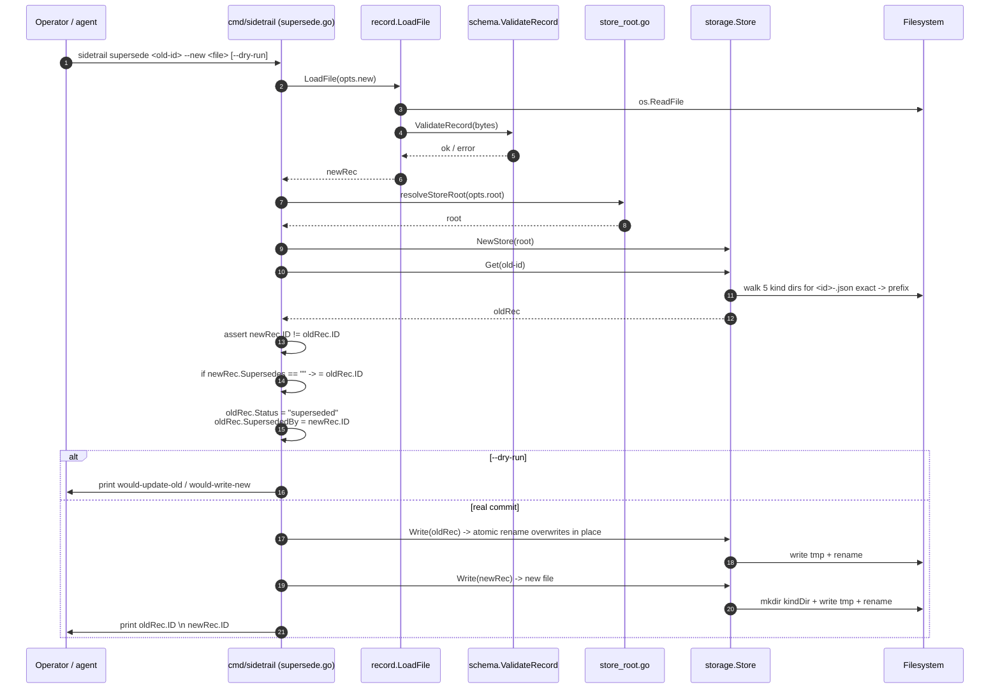

# Sequences

Three end-to-end sequence diagrams for the flows a host
agent or a human operator is most likely to run. Each
diagram names the source files the messages come from so
that the trace can be followed in the code.

The three flows are:

- [`ask`](#ask---read-dominant-primary-path): the read-
  dominant path a host agent calls before acting.
- [`init`](#init---write-path): the heaviest write path,
  used once per project to seed the store.
- [`supersede`](#supersede---two-record-transaction): the
  only path that mutates two records in lockstep.

## `ask` — read-dominant primary path

Source: [`cmd/sidetrail/ask.go`](../../cmd/sidetrail/ask.go),
[`cmd/sidetrail/list.go`](../../cmd/sidetrail/list.go),
[`cmd/sidetrail/store_root.go`](../../cmd/sidetrail/store_root.go),
[`internal/storage/store.go`](../../internal/storage/store.go),
[`internal/record/match.go`](../../internal/record/match.go).

## `init` — write path

Source: [`cmd/sidetrail/init.go`](../../cmd/sidetrail/init.go),
[`cmd/sidetrail/store_root.go`](../../cmd/sidetrail/store_root.go),
[`internal/record/record.go`](../../internal/record/record.go),
[`internal/storage/store.go`](../../internal/storage/store.go).

## `supersede` — two-record transaction

Source: [`cmd/sidetrail/supersede.go`](../../cmd/sidetrail/supersede.go),
[`cmd/sidetrail/store_root.go`](../../cmd/sidetrail/store_root.go),
[`internal/record/load.go`](../../internal/record/load.go),
[`internal/storage/store.go`](../../internal/storage/store.go).

