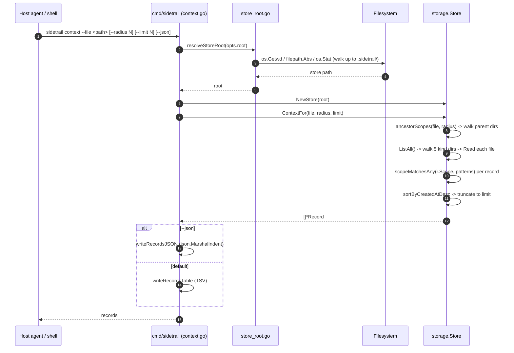
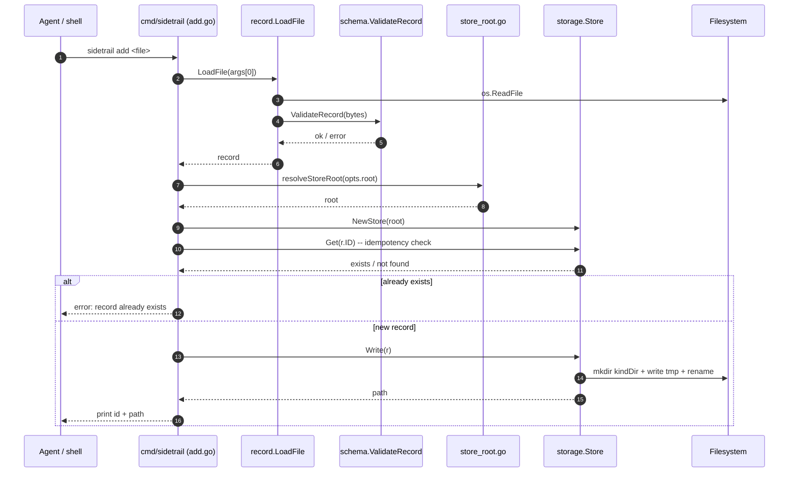
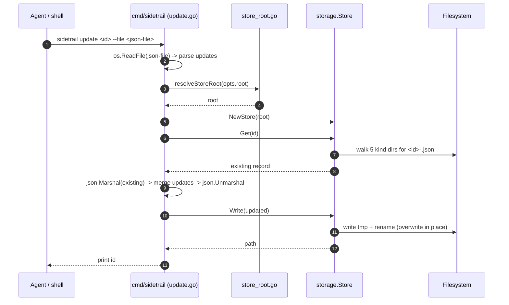

# Sequences

Three end-to-end sequence diagrams for the flows a host
agent or a human operator is most likely to run. Each
diagram names the source files the messages come from so
that the trace can be followed in the code.

The three flows are:

- [`context`](#context---read-dominant-primary-path): the read-
  dominant path a host agent calls before acting.
- [`add`](#add---write-path): the primary write path for
  recording decisions, constraints, and signals.
- [`update`](#update---partial-update): the path for updating
  existing records with partial JSON fields.

## `context` — read-dominant primary path

Source: [`cmd/sidetrail/context.go`](../../cmd/sidetrail/context.go),
[`cmd/sidetrail/store_root.go`](../../cmd/sidetrail/store_root.go),
[`internal/storage/store.go`](../../internal/storage/store.go).

## `add` — write path

Source: [`cmd/sidetrail/add.go`](../../cmd/sidetrail/add.go),
[`cmd/sidetrail/store_root.go`](../../cmd/sidetrail/store_root.go),
[`internal/record/load.go`](../../internal/record/load.go),
[`internal/storage/store.go`](../../internal/storage/store.go).

## `update` — partial update

Source: [`cmd/sidetrail/update.go`](../../cmd/sidetrail/update.go),
[`cmd/sidetrail/store_root.go`](../../cmd/sidetrail/store_root.go),
[`internal/storage/store.go`](../../internal/storage/store.go).

