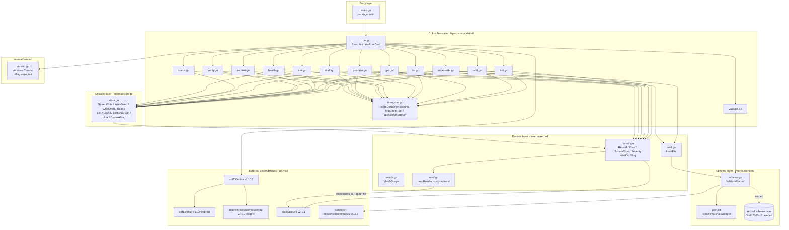

# Topology

Module and library graph. The diagram is derived from a full
read of `main.go`, every file under `cmd/sidetrail/`, every
file under `internal/`, and `go.mod`. Edges labelled
"uses" are direct package-level imports; the dashed embed
edge from the schema package to its JSON resource is the
`//go:embed` directive; the dashed edge from the record
package to the external ULID library marks the implicit
`io.Reader` contract that the local `randReader` adapts to.

## Module and library graph

## External dependencies (from `go.mod`)

| Library | Version | Role |
| --- | --- | --- |
| `github.com/spf13/cobra` | v1.10.2 | CLI framework: root command, subcommand registration, `Args` / `RunE`, and flag parsing. |
| `github.com/oklog/ulid/v2` | v2.1.1 | Record identifiers. Lexicographically sortable by creation time. |
| `github.com/santhosh-tekuri/jsonschema/v5` | v5.3.1 | Compile and validate against the embedded Draft 2020-12 schema. |
| `github.com/spf13/pflag` | v1.0.9 (indirect) | POSIX-style flag parser used internally by cobra. |
| `github.com/inconshreveable/mousetrap` | v1.1.0 (indirect) | Windows helper bundled with cobra. |

## Caveats from the source read

- **`init` is the only subcommand whose `--root` flag means
  something different.** It points at the project root
  (where `.sidetrail/` will be created), not at the
  `.sidetrail/` directory itself, because the directory
  does not exist on first run.
- **`verify` truncates to whole seconds** before writing.
  The timestamp printed to stdout and the timestamp written
  into the record JSON are the same string, byte for byte.
- **`ContextFor` does not interpret glob patterns.** Its
  candidate scopes are derived from a fixed ancestor walk,
  so plain equality on each candidate is sufficient to
  express "the file's own scope" and "an ancestor
  directory's scope". `MatchScope`'s descendant rule is
  intentionally not used here.
- **`findStoreRoot` does not follow symlinks.** It uses
  `os.Stat`, not `EvalSymlinks`. The first directory that
  contains a `.sidetrail/` subdirectory wins; the search
  stops at the filesystem root.
